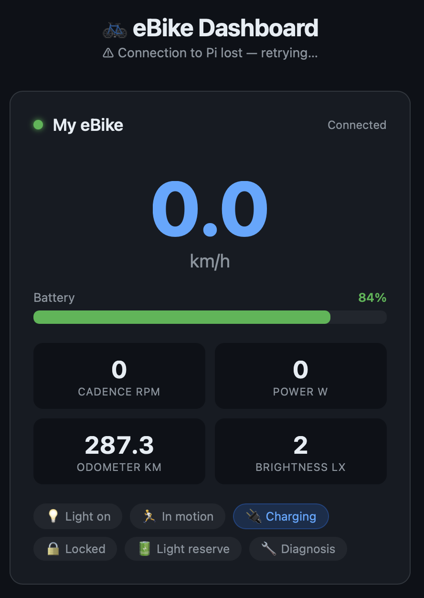
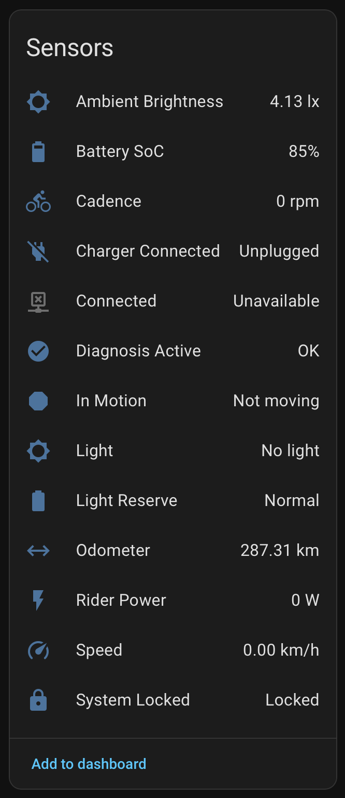

# ha-bosch-ebike-pibridge

Raspberry Pi BLE → Home Assistant / MQTT bridge for the **Bosch eBike Live Data Interface (LDI)**.

Runs directly on a Raspberry Pi instead of an ESP32. One Pi handles **two bikes simultaneously** using its built-in Bluetooth 5.0. Includes a live web dashboard viewable in any browser.



> Protocol details based on [ha-bosch-ebike](https://github.com/Xunil99/ha-bosch-ebike) by Xunil99.

---

## How it works

```
eBike (BLE central)
  └─connects to──▶ Raspberry Pi (BLE peripheral, advertising SolicitUUID)
                       └─GATT client──▶ reads eb21 notifications
                           └─MQTT──▶ Home Assistant (auto-discovery)
                           └─HTTP──▶ Web dashboard (port 8080)
```

1. The Pi advertises a **Service Solicitation UUID** matching the Bosch LDI GATT service
2. The eBike scans, finds the advertisement, connects and bonds (Just-Works LE Secure Connections)
3. The Pi subscribes to GATT notifications on the Live Data characteristic (`eb21`)
4. Each notification is decoded from protobuf and published as JSON to MQTT
5. Home Assistant auto-discovers all 13 entities via MQTT discovery
6. The web dashboard reads the same MQTT feed and displays live data in the browser

---

## Requirements

| | |
|---|---|
| **Hardware** | Raspberry Pi 3B+ / 4 / 5 / Zero 2W (built-in Bluetooth required) |
| **OS** | Raspberry Pi OS Lite 64-bit (Bookworm) |
| **eBike** | Bosch smart system, control unit firmware **≥ v19** |
| **Home Assistant** | Mosquitto MQTT broker add-on |

---

## Installation

```bash
git clone https://github.com/possm/ha-bosch-ebike-pibridge.git
cd ha-bosch-ebike-pibridge
sudo bash install.sh
```

The script installs all dependencies (`python3-dbus`, `python3-gi`, `python3-yaml`, `python3-flask`, `bluetooth`, `bluez`, `paho-mqtt`), copies files to `/opt/bosch-ebike-bridge/`, and enables both systemd services so they start on every boot.

---

## Configuration

Edit `/etc/bosch-ebike-bridge/config.yaml`:

```yaml
bridge_name: "HA eBike Bridge"

mqtt:
  broker: 192.168.x.x       # your HA / Mosquitto IP
  port: 1883
  username: mqtt-user
  password: yourpassword
  base_topic: bosch_ebike

# Optional: change the dashboard port (default 8080)
# dashboard_port: 8080

# Optional: give bikes a friendly name by BLE address.
# Find the address after first pairing:
#   sudo bluetoothctl -- devices
bikes:
  - address: "AA:BB:CC:DD:EE:FF"
    name: "My eBike"
  - address: "AA:BB:CC:DD:EE:GG"
    name: "Partner's eBike"
```

Apply changes:
```bash
sudo systemctl restart bosch-ebike-bridge bosch-ebike-dashboard
```

---

## Pairing a new bike

The eBike only scans for accessories when explicitly triggered via the **Bosch Flow App** — it does not connect automatically on first use.

1. Power on the eBike and make sure the bridge is running
2. Open the **Bosch Flow App** → your bike → **⚙ gear icon** (top-right)
3. Tap **Components** → **Add new device**
4. The bike enters scan mode — it should find **"HA eBike Bridge"** within ~30 seconds
5. Confirm pairing on the bike's display (no PIN needed)

After pairing the bike reconnects automatically every time it powers on within range of the Pi.

---

## Web dashboard

Open **http://e-bike-bridge.local:8080** in any browser (phone, tablet, laptop).

- Live speed, cadence, power, battery %, odometer — updates instantly via Server-Sent Events, no page reload
- Battery bar with colour coding (green → orange → red)
- Status chips: light, in motion, charging, locked, light reserve, diagnosis
- When a bike is **offline**: card dims and shows last known values with a "Last seen X ago" label that counts up every 10 seconds
- Both bikes shown side by side when both are connected

---

## Entities in Home Assistant

All 13 entities appear automatically under **Settings → Devices & Services → MQTT**:



| Entity | Type | Unit |
|---|---|---|
| Speed | Sensor | km/h |
| Cadence | Sensor | rpm |
| Rider Power | Sensor | W |
| Ambient Brightness | Sensor | lx |
| Battery SoC | Sensor | % |
| Odometer | Sensor | km |
| Connected | Binary sensor | — |
| Light | Binary sensor | — |
| System Locked | Binary sensor | — |
| Charger Connected | Binary sensor | — |
| Light Reserve | Binary sensor | — |
| Diagnosis Active | Binary sensor | — |
| In Motion | Binary sensor | — |

**When the bike is off or out of range**, all entities keep their last known values — speed, battery %, odometer, etc. remain visible in HA dashboards and automations. The **Connected** binary sensor is the explicit online/offline indicator. State values are published as retained MQTT messages so they survive HA and Pi reboots.

---

## Service management

```bash
# Status
sudo systemctl status bosch-ebike-bridge
sudo systemctl status bosch-ebike-dashboard

# Live logs
sudo journalctl -u bosch-ebike-bridge -f
sudo journalctl -u bosch-ebike-dashboard -f

# Restart both
sudo systemctl restart bosch-ebike-bridge bosch-ebike-dashboard
```

---

## Troubleshooting

| Symptom | Cause | Fix |
|---|---|---|
| `MQTT connect failed (rc=5)` | Wrong credentials | Check `config.yaml`; verify the user exists in the Mosquitto add-on config |
| `org.bluez.Error.Failed` on start | Bluetooth soft-blocked by rfkill | `sudo rfkill unblock bluetooth` — the service does this automatically on the next restart |
| Bike not found in Flow App scan | Bridge not advertising | Check `ActiveInstances: 1` via `sudo bluetoothctl show` |
| `LDI characteristic not found` | eBike firmware < v19 | Update firmware via the Bosch Flow App |
| Entities show `unknown` after pairing | Bike disconnected before initial GATT read | Power-cycle the bike |
| Entities show `unavailable` after updating | HA still has old discovery config with availability topic | Delete the MQTT device in HA and let it re-discover on next bike connection |

---

## Credits

Inspired by [ha-bosch-ebike](https://github.com/Xunil99/ha-bosch-ebike) by [Xunil99](https://github.com/Xunil99) — great work on reverse-engineering the Bosch LDI protocol. I didn't have a spare ESP32 lying around, so I took the same idea and built a Python version that runs straight on a Raspberry Pi instead.

## License

Apache-2.0
